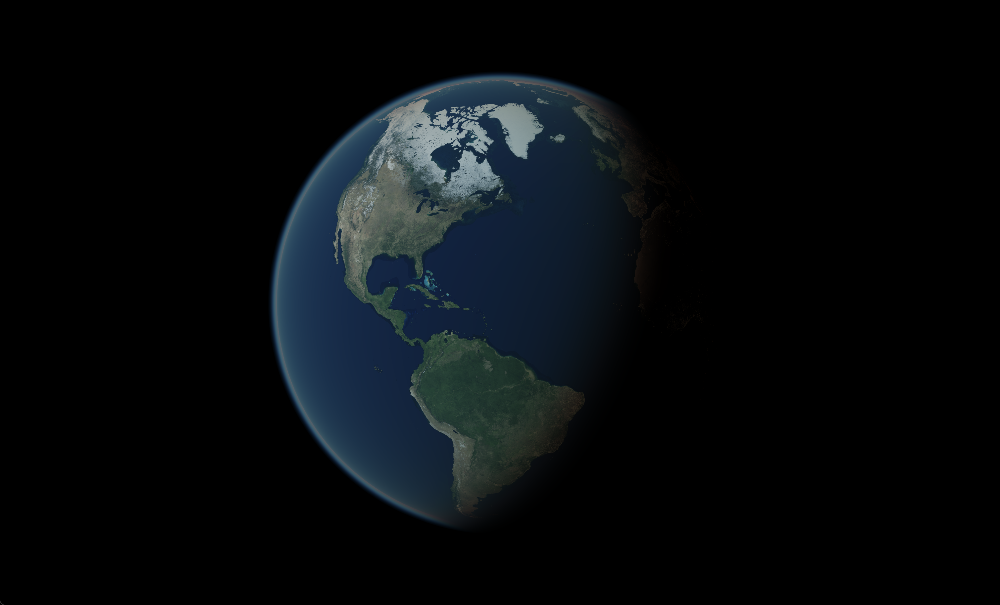

# rayleigh

This is an implementation of the algorithm described by the paper
"Display of The Earth Taking into Account Atmospheric Scattering" 
by Nishita et al., available at
http://nishitalab.org/user/nis/cdrom/sig93_nis.pdf.

Here is an example render produced by this code:

